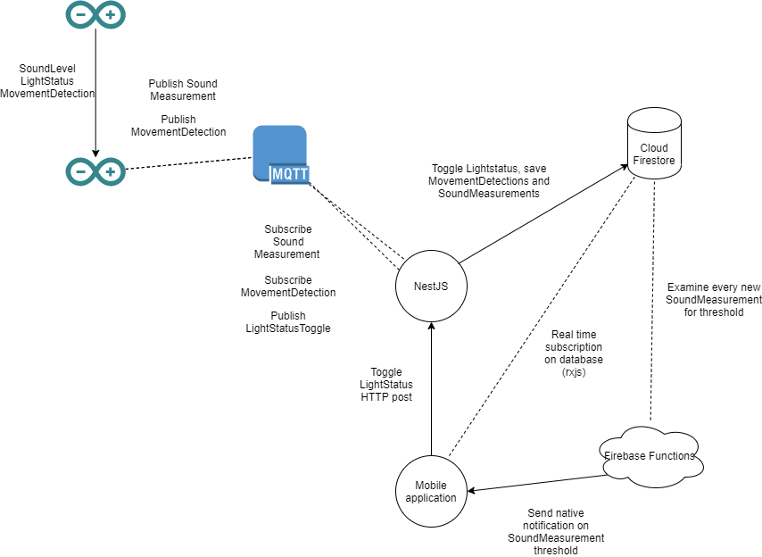

# PubSub-IOT
An IOT project using the MQTT protocol on an arduino to detect movement, sound and to toggle a light.

## Description
This project was made as an assignment during an IOT course while earning my bachelor's degree. 
The concept is to build an IOT 'baby monitoring' solution. A baby needs to be monitored for sound and movement. A toggleable nightlight is also needed.
When sound is above a certain level (the baby cries), the parents should be notified. 

## Implementation

The project is built using two arduinos. One arduino sends the data, the other acts as a MQTT client, subscribing and publishing to topics using a mqtt broker (external). 
A backend server also subscribes to certain topics and writes received data to a Firestore NoSQL database.
A frontend app built in ionic subscribes to this database using RxJS. 
Cloud functions are used to send push notifications to the smartphone of the parents whenever a sound measurement is above a certain threshold.

## Technical

Two arduinos are used for the monitoring itself. 
Three topics are used: "light", "sound" and "movement".
Sound measurements are sent every x seconds, movement on detection. The light status is published as a boolean when the arduino starts up, true meaning on, false meaning off.

The backend server, built in NestJS, uses a [mqtt service](https://github.com/DM-be/PubSub-IOT/blob/master/backend/nestjs-server/project/src/mqtt/mqtt.service.ts) to act as a client connecting to a mqtt broker.
A remote Firestore database is used. Whenever a message is received in a subscribed topic, the data is written to the Firestore. 

[Cloud functions](https://github.com/DM-be/PubSub-IOT/blob/master/backend/cloud/functions/src/index.ts)  for Firebase is used to send the notifications.
It keeps track of the collection of sound measurements, when it reaches a certain threshold it sends out a [push notification](https://medium.com/@nileshsingh/how-to-add-push-notification-capability-to-your-android-app-a3cac745e56e) to the appropriate devices.
This notification is seen without the need to have the app open. When the app is open, it sends an ionic notification to the user. 

The ionic app keeps track of all soundmeasurements/movementdetections and the status of the nightlight. The nightlight can be turned on and off using a button. 
When the user taps a button, a request is sent to the backend [light controller](https://github.com/DM-be/PubSub-IOT/blob/master/backend/nestjs-server/project/src/light/light.controller.ts). This controller uses the mqtt service to reverse the status of the light. It publishes on the light topic, with a unique identifier for the arduino.
The arduino subscribes to this topic and toggles the light. 

